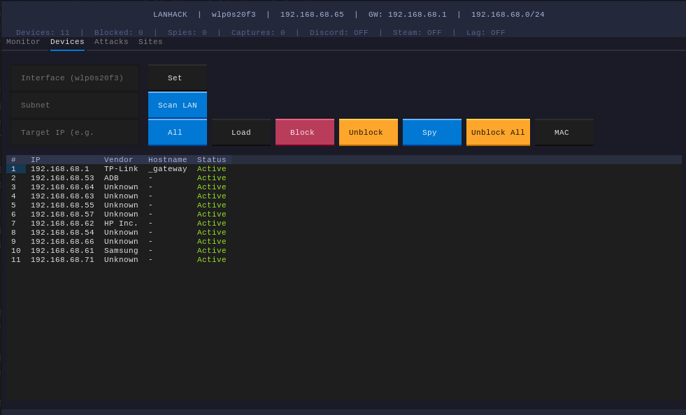
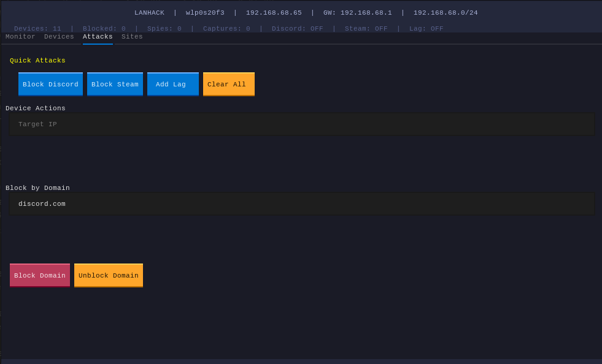
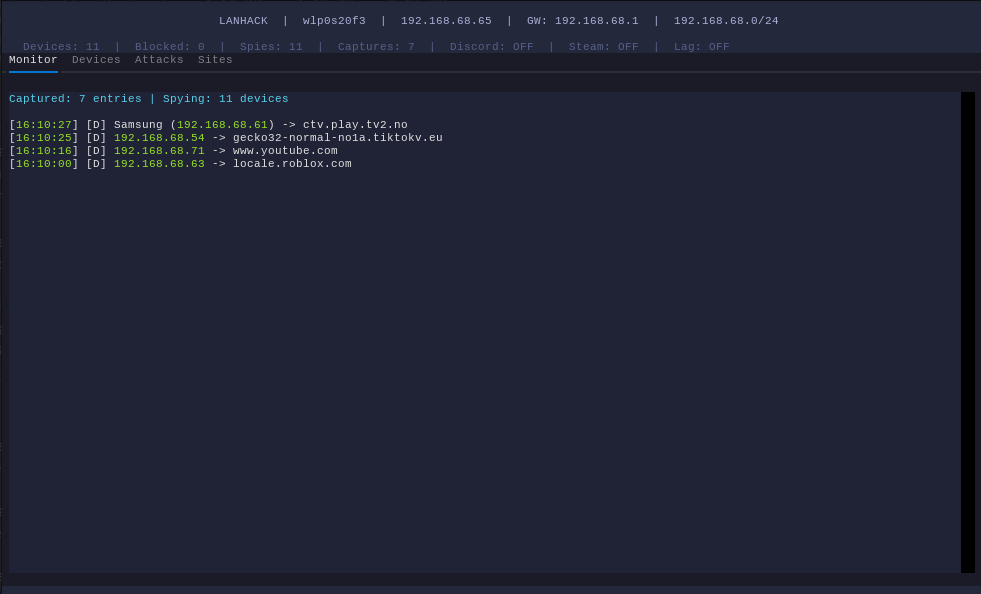

# LANHACK

A terminal-based LAN manipulation toolkit with a modern TUI. ARP spoof, block devices, spy on traffic, inject latency, and block domains — all from a mouse-clickable interface.

## Screenshots

<p align="center">
  
  <br><em>Device scan with block/spy controls</em>
</p>

<table>
  <tr>
    <td align="center" width="50%">
      
      <br><em>Quick attacks: Discord/Steam/Lag and block by domain</em>
    </td>
    <td align="center" width="50%">
      
      <br><em>Live website monitor — see every domain targets visit in real time</em>
    </td>
  </tr>
</table>

## Features

- **LAN Scan** — discover all devices on your network (IP, MAC, vendor, hostname)
- **Block/Unblock** — cut internet access for any device via ARP spoof
- **Spy Mode** — ARP-spoof a target without blocking, see every site they visit
- **Live Monitor** — real-time capture of DNS queries and TLS handshakes across all spied devices
- **Quick Attacks** — one-click Discord/Steam blocking via iptables, latency injection via `tc`
- **Block by Domain** — resolve any domain to IPs and block them (FORWARD + OUTPUT chains)
- **Open Captured Sites** — click any captured domain to open in browser (with CDN→main site mapping)
- **Active Spies List** — shows which IPs are currently being monitored
- **MAC Toggle** — show/hide MAC addresses in the device table
- **Configurable Interface** — set the network interface at runtime
- **Auto-Scan** — automatically re-scans the LAN every 30 seconds, detects and notifies when new devices appear
- **Traffic Graphs** — live bar charts for bandwidth per device and top visited domains
- **Device Fingerprinting** — scans open ports and identifies device type (Windows, macOS, Linux, Samsung TV, IoT, cameras, etc.)
- **HTTPS Interception (DEMO)** — decrypts HTTPS traffic via mitmproxy; full URLs including paths and query parameters
- **Wake-on-LAN** — wake sleeping devices before spying or blocking
- **Stealth Mode** — randomized ARP intervals (1.2–3.1s) to evade detection tools like `arpwatch`
- **Global DNS Block** — built-in DNS sinkhole that intercepts all LAN DNS traffic via iptables redirect
- **MAC-Based Blocking** — block by MAC address so it survives DHCP IP changes
- **Interface Selection** — change network interface at runtime without restart
- **Credential Harvester** — captures passwords and form data from HTTP pages via JS injection; HTTPS credentials via mitmproxy addon

## Requirements

- Linux (uses `/proc/net/route`, `iptables`, `tc`)
- Python 3.10+
- Root access (`sudo`)

## Quick Start

```bash
git clone https://github.com/N-Choo/lanhack.git
cd lanhack
sudo python3 lanhack.py
```

Dependencies (`scapy`, `textual`) auto-install on first run.

## Usage

| Tab | What it does |
|-----|-------------|
| **Monitor** | Live website stream from spied devices |
| **Devices** | Scan LAN, set interface, block/spy by IP, toggle MAC |
| **Attacks** | Discord/Steam/Lag toggles, device actions, block by domain, global DNS block, stealth mode |
| **Sites** | Captured domains, click to open in browser |

### Credential Harvester

Two modes, both toggled from the **Attacks** tab:

**HTTP Harvester** (no CA needed):
1. Toggle **Harvester** ON — redirects all port 80 traffic through a local Python proxy
2. The proxy injects JavaScript into every HTML page that monitors password fields and form submissions
3. Captured data appears next to the toggle (e.g. `Harvester: ACTIVE (5 captured)`)
4. Click **View Captured** to see the last 10 entries
5. Works on any HTTP site — old routers, IoT dashboards, internal network pages

**HTTPS Credential Extraction** (requires HTTPS Interception):
1. First toggle **HTTPS Intercept** ON (target must trust the CA once)
2. mitmproxy loads an addon that scans ALL decrypted POST/PUT bodies
3. Automatically logs any request containing: `password`, `login`, `token`, `secret`, `api_key`, `credit`
4. Results saved to `/tmp/lanhack_creds.txt` — click **View Captured** to see them

**Combined workflow for maximum coverage:**
```
1. Enable HTTPS Intercept → target trusts CA → all HTTPS decrypted
2. Enable Harvester → all HTTP gets JS injected
3. Both credential sources captured simultaneously
4. Click View Captured to see everything
```

### HTTPS Interception (DEMO)

Toggle in the **Attacks** tab. Auto-installs `mitmproxy`, generates a CA certificate, and redirects all HTTP/HTTPS traffic through it via iptables.

**For full decryption:** the target device must download and trust the CA certificate at `~/.mitmproxy/mitmproxy-ca.pem` (or navigate to `mitm.it` while interception is active). After trust is installed, every HTTPS URL becomes visible — paths, query parameters, and POST data.

**Limitations:** certificate-pinned apps and modern browsers with HSTS preload will still show warnings. This is a DEMO feature — functional but requires target cooperation for full HTTPS visibility.

### Device Fingerprinting

After scanning, click **Fingerprint** in the Devices tab. LANHACK sends SYN packets to 15 common ports on each device and matches the open port pattern against known device signatures:
- **Windows**: ports 135, 139, 445
- **Linux/SSH**: port 22
- **macOS/iOS**: ports 3689, 62078
- **Samsung TV**: ports 7000, 7676
- **IP Camera**: port 554 (RTSP)
- **IoT**: port 8883 (MQTT)

Results appear in the "Fingerprint" column alongside each device.

### Traffic Graphs

In the **Monitor** tab, click **Graphs** to switch from the site log to live bar charts:
- **Bandwidth per device** — top 5 devices by KB transferred (last 30 packets)
- **Top domains** — most visited domains ranked by hit count

Data updates every 2 seconds. Click **List View** to switch back.

### Auto-Scan

Click **Auto Scan** in the Devices tab — scans your subnet every 30 seconds and silently merges new devices into the existing list. Shows a notification when a previously unseen device joins the network. Click again to stop.

### Wake-on-LAN

Select a device row or type its IP, then click **WoL** in the Devices tab — sends a magic packet to wake a sleeping device before spying or blocking.

### Stealth Mode

Toggle in the Attacks tab. When active, ARP spoof packets are sent at randomized intervals (1.2–3.1s) instead of a fixed 1.5s pattern, making the spoofing blend in with normal network chatter and harder for detection tools to flag.

### Global DNS Block

Toggle in the Attacks tab. Starts a Python DNS server on port 53 and redirects all LAN DNS traffic to it via iptables `PREROUTING`. Domains in the blocklist resolve to `127.0.0.1`; everything else is forwarded to Cloudflare (1.1.1.1). No ARP spoof needed — every device on the network is blocked at the DNS level.

### Workflow

1. Open **Devices** tab → set Interface if needed → click **Scan LAN**
2. Click a device row to load its IP, or type one manually
3. Click **Spy** → their traffic routes through your machine
4. Switch to **Monitor** tab → see every website they visit in real time
5. Use **Attacks** tab to block Discord, Steam, or add lag

### Block by Domain

```
Type "discord.com" → click "Block Domain"
→ resolves to live IPs → blocks FORWARD + OUTPUT via iptables
```

## How It Works

LANHACK uses **ARP spoofing** to redirect a target's traffic through your machine. The `scapy` sniffer captures DNS queries and TLS Server Name Indication (SNI) from the forwarded traffic, showing every domain the target visits — even for HTTPS sites.

For blocking, it inserts `iptables` rules at position 1 (before Docker chains) on both the FORWARD and OUTPUT chains.

Latency attacks use `tc` (traffic control) to add jitter, packet loss, and bandwidth throttling.

The Global DNS Block runs a slim Python DNS server on port 53 and uses `iptables -t nat -I PREROUTING` to redirect all LAN DNS queries through it — no ARP spoof needed for domain-level blocking.

Stealth mode randomizes ARP reply timing and avoids broadcasting to the gateway when unnecessary, reducing the detectable signature.

## Limitations

- ARP spoofing is detectable on networks with DAI / port security
- You must keep the app running to maintain blocks and spies
- Only outgoing DNS queries are captured (not full HTTPS paths)
- HTTPS decryption requires installing a custom CA on the target device

## License

MIT
