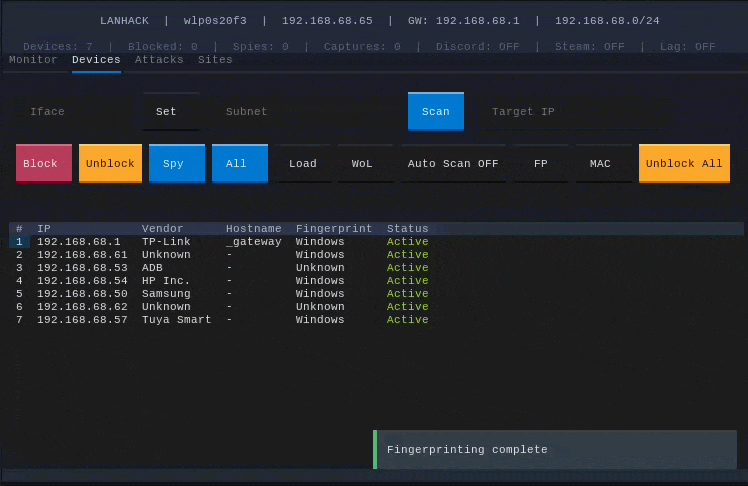

# LANHACK

A terminal-based LAN manipulation toolkit with a modern TUI. ARP spoof, block devices, spy on traffic, inject latency, harvest credentials, and block domains — all from a mouse-clickable interface.

<p align="center">
  
  <br><em>Scan, spy, and monitor in real time</em>
</p>

---

## Quick Start

```bash
git clone https://github.com/N-Choo/lanhack.git
cd lanhack
sudo python3 lanhack.py
```

Dependencies (`scapy`, `textual`, `mitmproxy`) auto-install on first run.

---

## Features at a Glance

| Tab | Purpose |
|-----|---------|
| **Monitor** | Live website stream from spied devices; switch to traffic graphs |
| **Devices** | Scan LAN, fingerprint devices, block/spy/WoL, auto-scan, MAC toggle |
| **Attacks** | Discord/Steam/Lag toggles, domain block, global DNS, stealth, HTTPS intercept, credential harvester |
| **Sites** | Captured domains list; click to open in browser; export to CSV+JSON |

### All Features

| Category | Feature | Description |
|----------|---------|-------------|
| **Recon** | LAN Scan | Discover all devices (IP, MAC, vendor, hostname) |
| | Device Fingerprinting | Scan open ports — identifies Windows, Samsung TV, IoT, cameras, etc. |
| | Auto-Scan | Continuously scans every 30s, notifies on new devices |
| **Monitoring** | Live Website Monitor | Real-time DNS and TLS SNI capture across all spied devices |
| | Traffic Graphs | Bar charts for bandwidth per device and top domains |
| | Export Captures | Save all captured domains to CSV + JSON |
| **Spying** | Spy Mode | ARP-spoof a target without blocking; see every site they visit |
| | Open Captured Sites | Click any domain to open in your browser (CDN→main site mapping) |
| **Blocking** | Device Block | Cut internet for any device via ARP + MAC-based iptables (survives DHCP) |
| | Domain Block | Resolve any domain to IPs and block FORWARD + OUTPUT chains |
| | Global DNS Block | DNS sinkhole via iptables — blocks every device on the LAN without ARP spoof |
| | Quick Blocks | One-click Discord and Steam blocking |
| **Credential Harvest** | HTTP Harvester | Inject JS into HTTP pages to capture passwords and form submissions |
| | HTTPS Extraction | Auto-log POST/PUT bodies containing password/login/token fields |
| **Disruption** | Lag Attack | Add 500ms latency + 5% packet loss to any device via `tc` |
| **Utility** | Wake-on-LAN | Wake sleeping devices before spying |
| | Stealth Mode | Randomized ARP intervals to evade detection |
| | Interface Config | Change network interface at runtime |

---

## Usage Guides

### Basic Surveillance

```
1. Devices → Scan LAN
2. Click a device row (auto-fills its IP)
3. Click Spy → traffic routes through your machine
4. Monitor → watch every site they visit in real time
```

### Full Attack Chain

```
1.  Devices → Scan LAN
2.  Devices → Fingerprint (identify what each device is)
3.  Devices → Auto Scan (keep detecting new devices)
4.  Devices → Spy (redirect target's traffic)
5.  Monitor → watch live traffic or switch to Graphs
6.  Attacks → Lag Attack (add latency)
7.  Attacks → Block Discord / Block Steam
8.  Attacks → Block Domain "discord.com"
9.  Attacks → HTTPS Intercept (full URL visibility)
10. Attacks → Harvester (capture form data)
11. Attacks → View Captured (see all credentials)
12. Sites → Export (save to CSV+JSON)
```

### Ghost Mode (Zero Detectability)

```
1. Devices  → skip scanning
2. Attacks  → Global DNS Block ON
3. Attacks  → Stealth ON
4. Monitor  → watch all domains
5. Sites    → export captured data
```

No ARP spoof, no SYN scan, no active probes. Pure passive listening.

---

## Feature Deep Dives

### Credential Harvester

Two modes, both toggled from the **Attacks** tab:

**HTTP Harvester** (no setup, works immediately):
- Redirects port 80 through a local Python proxy
- Injects JavaScript into HTML pages that captures form submissions and password fields
- Works on any HTTP site — old routers, IoT dashboards, internal pages
- Click **View Captured** to see the last 10 entries

**HTTPS Extraction** (requires HTTPS Intercept + target CA trust):
- mitmproxy scans all decrypted POST/PUT bodies
- Auto-logs requests containing: `password`, `login`, `token`, `secret`, `api_key`, `credit`
- Results saved to `/tmp/lanhack_creds.txt`

**Combined workflow:**
```
1. HTTPS Intercept ON → target trusts CA
2. Harvester ON → HTTP gets JS injected
3. Both sources captured simultaneously
4. View Captured → everything in one place
```

### HTTPS Interception (DEMO)

Auto-installs `mitmproxy`, generates a CA certificate, and redirects all HTTP/HTTPS traffic through it via iptables.

**For full decryption:** the target must navigate to `mitm.it` while interception is active, download the certificate, and **trust it** in their device settings. After that, every HTTPS URL becomes visible — full paths, query parameters, and POST data.

**Limitations:** certificate-pinned apps and browsers with HSTS preload still show warnings. Requires target cooperation.

### Device Fingerprinting

Sends SYN packets to 15 common ports and matches open port patterns:

| Ports | Likely Device |
|-------|--------------|
| 135, 139, 445 | Windows |
| 22 | Linux/SSH |
| 3689, 62078 | macOS/iOS |
| 7000, 7676 | Samsung TV |
| 554 (RTSP) | IP Camera |
| 8883 (MQTT) | IoT Device |
| 80, 443 | Web Server |

Results appear in the "Fingerprint" column.

### Block by Domain

```
Type "discord.com" → click "Block Domain"
→ resolves to live IPs → blocks FORWARD + OUTPUT via iptables
```

### Wake-on-LAN

Select a device row or type its IP, then click **WoL** — sends a magic packet to wake a sleeping device before spying or blocking.

### Auto-Scan

Click **Auto Scan** — scans your subnet every 30 seconds and merges new devices into the existing list. Shows a notification when a previously unseen device joins. Click again to stop.

---

## Detectability Guide

### What's detectable

| Action | Detected? | Notes |
|--------|-----------|-------|
| Global DNS Block | **Invisible** | iptables PREROUTING — zero packets to targets |
| Stealth Mode | Lowers signature | Randomizes ARP timing |
| Spy / Block | **Detectable** | ARP spoof sends packets; `arpwatch` / `snort` may flag them |
| ARP Scan | **Detectable** | Burst of ARP requests across the subnet |
| Fingerprinting | **Detectable** | SYN packets logged by firewalls |
| HTTPS Intercept | Invisible on wire | But target must trust a CA (raises suspicion) |

### Detection risks explained

**ARP spoofing** is the most detectable feature. Managed switches with **DAI (Dynamic ARP Inspection)** drop spoofed ARP packets. Enterprise networks with **802.1X** block rogue traffic entirely. On standard home routers — effectively invisible; no one monitors ARP tables.

**SYN scans** (fingerprinting) are logged by any half-decent firewall. Skip fingerprinting when stealth matters.

**Global DNS Block** is truly passive — the kernel redirects DNS traffic to your local server. No device sees a packet from your machine.

---

## OPSEC: Staying Invisible

### Device Level

- **Use a throwaway machine** — boot Ubuntu from a USB stick (no persistent storage)
- **Spoof your MAC** before connecting:
  ```bash
  sudo macchanger -r wlp0s20f3
  ```
- **Use Ethernet** — Wi-Fi leaves logs on the access point; wired is quieter
- **Change your hostname**:
  ```bash
  sudo hostname randomhostname
  ```

### Network Level

- **Ghost mode only** — Global DNS Block + Stealth, no ARP spoof
- **Never connect to personal accounts** — no email, GitHub, or social media while running LANHACK
- **Clear router logs** — if you have admin access, delete DHCP lease logs
- **Route exfil through Tor/VPN** — from a secondary device, never from the LANHACK machine

### Post-Operation

```bash
# Clear system logs
sudo journalctl --rotate && sudo journalctl --vacuum-time=1s

# Clear shell history
history -c && rm -f ~/.bash_history

# Wipe temporary files
rm -rf /tmp/lanhack* ~/.lanhack* ~/.mitmproxy

# Uninstall tools
pip uninstall scapy textual mitmproxy -y
```

### The Safest Setup

```
1. Boot Ubuntu from USB on public Wi-Fi
2. sudo macchanger -r wlp0s20f3
3. sudo hostname unknown
4. sudo python3 lanhack.py
5. Ghost mode only (Global DNS Block)
6. Export captures, shut down, remove USB
```

Zero evidence. The USB boot has no persistence — no logs, no history, no trace.

---

## How It Works

LANHACK uses **ARP spoofing** to redirect a target's traffic through your machine. The `scapy` sniffer captures DNS queries and TLS Server Name Indication (SNI) from forwarded traffic, showing every domain the target visits — even for HTTPS sites.

For blocking, it inserts `iptables` rules at position 1 (before Docker chains) using MAC addresses to survive DHCP IP changes.

The **Global DNS Block** runs a Python DNS server on port 53 that checks queries against a blocklist, returning `127.0.0.1` for blocked domains and forwarding everything else to Cloudflare.

**Credential harvesting** uses two methods: a Python proxy that injects JS into HTTP pages, and a mitmproxy addon that scans decrypted POST bodies.

**Stealth mode** randomizes ARP timing. **Latency attacks** use `tc` (traffic control).

---

## Requirements

- Linux (uses `/proc/net/route`, `iptables`, `tc`, `ip`)
- Python 3.10+
- Root access (`sudo`)

---

## Limitations

- ARP spoofing is detected by DAI / port security on managed networks
- LANHACK must stay running to maintain blocks and spies
- HTTPS Interception requires the target to trust a custom CA
- Credential harvester only captures HTTP without HTTPS Intercept enabled

---

## License

MIT
